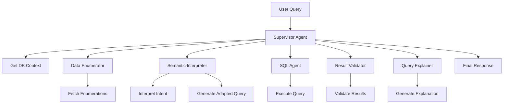

# Intelligent Agent Framework - Technical Implementation Guide

## Table of Contents
1. [Overview](#overview)
2. [Architecture Changes](#architecture-changes)
3. [Component Details](#component-details)
4. [Data Flow](#data-flow)
5. [Schema and Data Handling](#schema-and-data-handling)
6. [Query Processing Pipeline](#query-processing-pipeline)
7. [Example Walkthrough](#example-walkthrough)
8. [Performance Considerations](#performance-considerations)
9. [Testing and Validation](#testing-and-validation)

## Overview

The TrueFi agent framework has been enhanced with five major improvements to create a truly intelligent, context-aware system that can handle complex financial queries without hardcoded logic.

### Core Principles
- **Dynamic Discovery**: No hardcoded values - everything is discovered from the database
- **Semantic Understanding**: Interprets user intent beyond literal words
- **Context Awareness**: Adapts queries based on user's actual data
- **Transparent Processing**: Explains all adaptations and reasoning
- **Scalable Intelligence**: Handles millions of varied queries without programmatic fixes

## Architecture Changes

### New Components Added

```
/TRUEFIBACKEND/agents/utils/
├── data_enumerator.py      # Dynamically fetches valid values from DB
├── semantic_interpreter.py   # Understands query intent
├── result_validator.py      # Validates results against context
└── query_explainer.py       # Generates user-friendly explanations
```

### Enhanced Components

- **SimpleSupervisorAgent**: Now orchestrates all new components
- **SimpleSQLAgent**: Uses full schema and context-aware prompts
- **SchemaRegistry**: Added `get_full_schema_smart()` method

## Component Details

### 1. Schema Registry Enhancement

**File**: `/TRUEFIBACKEND/agents/utils/schema_registry.py`

```python
def get_full_schema_smart(self) -> str:
    """Get complete schema but with smart limits for large tables."""
    
    # Tables that can be very large - show only key columns
    large_tables = {'transactions', 'chat_messages', 'agent_run_log'}
    
    for table, cols in self._full_schema.items():
        if table in large_tables:
            # For transactions: only show essential columns
            # id, user_id, account_id, amount, date, merchant_name, category, pending
            essential_cols = [...]
        else:
            # For all other tables: show ALL columns
            # This includes accounts, budgets, goals, etc.
```

**Key Points**:
- Full schema for all tables EXCEPT large ones
- Transactions table: Only schema structure, not data rows
- Essential columns preserved for transactions
- Merchant filtering relies on entity resolver

### 2. Data Enumerator

**File**: `/TRUEFIBACKEND/agents/utils/data_enumerator.py`

```python
async def get_user_enumerations(self, user_id: str) -> Dict[str, Any]:
    """Dynamically fetch all valid values for a user."""
    
    # System-wide enumerations
    - all_account_types        # All possible account types in system
    - all_account_subtypes     # All subtypes
    - all_transaction_categories # Top 100 categories
    - all_budget_periods       # Budget period types
    - all_goal_types          # Goal types
    
    # User-specific enumerations
    - user_account_types      # What THIS user has
    - user_account_names      # User's actual account names
    - user_categories         # User's top 50 categories
    - user_merchants          # User's top 100 merchants
    - user_budget_categories  # User's budget categories
```

**Caching**: Results cached for 5 minutes to balance freshness and performance

### 3. Semantic Interpreter

**File**: `/TRUEFIBACKEND/agents/utils/semantic_interpreter.py`

```python
async def interpret_query(self, query: str, context: Dict, enumerations: Dict) -> Dict:
    """Understand query intent beyond literal interpretation."""
    
    Returns:
    {
        "literal_request": {
            "entities": ["checking", "savings"],
            "action": "get balance",
            "filters": {"account_types": ["checking", "savings"]}
        },
        "semantic_intent": {
            "primary_goal": "know available liquid funds",
            "alternative_interpretations": ["total cash", "non-investment funds"],
            "confidence": 0.85
        },
        "adaptations_needed": {
            "mismatch_detected": true,
            "reason": "User has no checking/savings accounts",
            "suggested_adaptation": "Show all non-investment accounts",
            "explanation_for_user": "You don't have checking or savings accounts..."
        }
    }
```

**Common Patterns Detected**:
- Liquid funds requests → Maps to available account types
- Debt summaries → Includes all credit accounts and loans
- Spending analysis → Groups by category with time ranges
- Savings progress → Shows goal completion percentages

### 4. Result Validator

**File**: `/TRUEFIBACKEND/agents/utils/result_validator.py`

```python
async def validate_result(self, query: str, sql_result: Dict, 
                         user_context: Dict, semantic_interpretation: Dict) -> Dict:
    """AI-powered validation of query results."""
    
    # Basic validation (no AI needed)
    - Check for query errors
    - Detect suspicious zero results
    - Flag extremely large result sets
    
    # AI validation for complex cases
    - Logical inconsistencies ($0 when accounts exist)
    - Data quality issues
    - Intent vs. result mismatches
    - Suggestions for improvements
```

### 5. Query Explainer

**File**: `/TRUEFIBACKEND/agents/utils/query_explainer.py`

```python
async def generate_explanation(self, original_query: str, sql_executed: str,
                              results: Dict, adaptations: Dict, validation: Dict) -> Dict:
    """Generate comprehensive explanation of query processing."""
    
    Returns:
    {
        "summary": "I searched for your checking and savings accounts...",
        "interpretation": "You wanted to know your liquid cash balance",
        "data_searched": "All active accounts (investment and credit)",
        "adaptations": [{
            "what": "Expanded search to all accounts",
            "why": "You don't have checking/savings accounts",
            "impact": "Shows your total available balance"
        }],
        "results_explanation": "Your total balance is $43,800 across 2 accounts",
        "suggestions": ["View account breakdown", "Set up a savings goal"],
        "confidence_level": "high"
    }
```

## Data Flow

### Query Processing Pipeline



### Detailed Flow

1. **User Query Received**
   ```python
   "What's my checking account balance?"
   ```

2. **Context Gathering**
   - Database context (accounts, transactions summary)
   - Data enumerations (user has: investment, credit)
   - Full schema provided to agents

3. **Semantic Interpretation**
   - Literal: checking account balance
   - Intent: liquid funds available
   - Mismatch: No checking account exists
   - Adaptation: Query all accounts instead

4. **SQL Generation**
   ```sql
   -- User asked for checking but has investment/credit
   SELECT name, type, balance 
   FROM accounts 
   WHERE user_id = 'xxx' AND is_active = true
   ```

5. **Result Validation**
   - Check: Results include user's accounts ✓
   - Check: No zero anomaly ✓
   - Check: Matches adapted intent ✓

6. **Explanation Generation**
   - What happened: Adapted to show all accounts
   - Why: You don't have a checking account
   - Result meaning: Total of $43,800 available

7. **Final Response**
   ```
   I noticed you asked about checking accounts, but you currently have 
   investment and credit accounts. Here's your account summary:
   
   • Wells Fargo 401k (investment): $45,000
   • BofA Credit Card (credit): -$1,200
   
   Total assets: $43,800
   ```

## Schema and Data Handling

### What Gets Passed to Agents

1. **Full Schema** (`get_full_schema_smart()`)
   - ✅ All tables with complete column lists
   - ✅ Relationships between tables
   - ⚠️ Transactions table: Only key columns (not data rows)
   - ✅ Schema notes and hints

2. **User Context** (from `get_user_database_context`)
   - ✅ All accounts (complete rows)
   - ✅ All assets/liabilities (complete rows)
   - ✅ Goals and budgets (complete rows)
   - ⚡ Transaction summaries (aggregated, not raw rows)
   - ✅ Top categories and merchants

3. **Data Enumerations** (from `DataEnumerator`)
   - ✅ Valid account types in system
   - ✅ User's actual account types
   - ✅ Categories and merchants (limited lists)

### Transaction Handling Strategy

**Why Special Treatment for Transactions?**
- Can be thousands of rows
- Would overwhelm LLM context
- Most queries need aggregations anyway

**Our Approach**:
1. Schema includes transaction structure
2. Entity resolver provides exact merchant names
3. SQL agent filters/aggregates as needed
4. Raw transaction data never sent to LLM

## Query Processing Pipeline

### Phase 1: Understanding
```python
# Supervisor coordinates understanding
interpretation = await semantic_interpreter.interpret_query(query, context, enumerations)
if interpretation.adaptations_needed.mismatch_detected:
    adapted_query = await semantic_interpreter.generate_adapted_query(...)
```

### Phase 2: Execution
```python
# SQL Agent generates and executes
sql_result = await sql_agent.process(
    query=adapted_query or original_query,
    user_context=enhanced_context,
    merchant_hints=resolved_merchants
)
```

### Phase 3: Validation
```python
# Validate results make sense
validation = await result_validator.validate_result(
    query, sql_result, db_context, interpretation
)
if validation.status == "warning":
    # May trigger re-execution or explanation
```

### Phase 4: Explanation
```python
# Generate user-friendly explanation
explanation = await query_explainer.generate_explanation(
    original_query, sql_executed, results, adaptations, validation
)
```

## Example Walkthrough

### Scenario: Complex Spending Query

**User Query**: "How much did I spend on food last month?"

**Step 1: Enumeration**
```json
{
  "user_categories": ["Groceries", "Restaurants", "Food & Dining", ...],
  "user_merchants": ["Trader Joe's", "Chipotle", "Starbucks", ...]
}
```

**Step 2: Interpretation**
```json
{
  "semantic_intent": {
    "primary_goal": "food spending analysis",
    "time_period": "previous calendar month",
    "includes": ["groceries", "restaurants", "food delivery"]
  }
}
```

**Step 3: SQL Generation**
```sql
-- Categories that relate to food based on user's data
SELECT 
    category,
    COUNT(*) as transaction_count,
    SUM(amount) as total_spent
FROM transactions
WHERE user_id = 'xxx'
    AND date >= DATE_TRUNC('month', CURRENT_DATE - INTERVAL '1 month')
    AND date < DATE_TRUNC('month', CURRENT_DATE)
    AND amount < 0  -- Expenses only
    AND category IN ('Groceries', 'Restaurants', 'Food & Dining')
GROUP BY category
ORDER BY total_spent
```

**Step 4: Validation**
- ✓ Results include food categories
- ✓ Time period is correct
- ✓ Amounts are negative (expenses)

**Step 5: Response**
```
Last month you spent $847.32 on food across 3 categories:

• Groceries: $423.18 (12 transactions)
• Restaurants: $312.45 (8 transactions)  
• Food & Dining: $111.69 (3 transactions)

This represents 18% of your total spending for the month.
```

## Performance Considerations

### Caching Strategy
- **Schema**: Cached on startup, rarely changes
- **Enumerations**: 5-minute TTL, user-specific
- **Query Results**: 5-minute TTL for identical queries

### Optimization Techniques
1. **Parallel Operations**: Context, enumerations, and interpretation run concurrently
2. **Smart Limits**: Large tables show only essential columns
3. **Aggregation First**: Transactions aggregated in SQL, not in application
4. **Selective Enhancement**: Only complex queries trigger full pipeline

### Resource Usage
- **LLM Calls**: 3-5 per complex query (interpretation, SQL, validation, explanation)
- **Database Queries**: 2-3 for context + 1 for main query
- **Memory**: Minimal due to aggregation approach

## Testing and Validation

### Test Coverage

1. **Unit Tests** (per component)
   ```python
   test_data_enumerator.py
   test_semantic_interpreter.py
   test_result_validator.py
   test_query_explainer.py
   ```

2. **Integration Tests**
   ```python
   test_intelligent_framework.py  # Full pipeline test
   test_edge_cases.py            # Unusual queries
   test_performance.py           # Load testing
   ```

3. **Scenario Tests**
   - Missing account types
   - Zero balances
   - No transaction history
   - Ambiguous time periods
   - Multiple interpretations

### Validation Metrics
- **Semantic Accuracy**: Does interpretation match intent?
- **Adaptation Success**: Do adapted queries return meaningful results?
- **Explanation Clarity**: Do users understand what happened?
- **Performance**: Sub-3 second response for 95% of queries

## Best Practices

### Adding New Features
1. Always use dynamic discovery (no hardcoding)
2. Add to enumerations if new data types
3. Update semantic patterns for new query types
4. Extend validation rules through AI, not code

### Debugging
1. Check agent logs for full pipeline trace
2. Examine semantic interpretation first
3. Validate enumerations match reality
4. Test SQL directly if needed

### Monitoring
- Track adaptation frequency
- Monitor validation warnings
- Analyze user feedback on explanations
- Identify common interpretation patterns