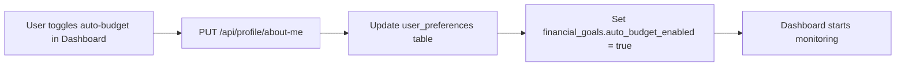
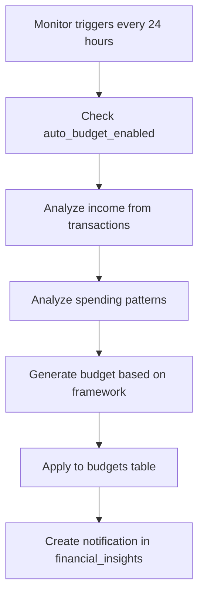

# Auto Budget Investigation Report

## Executive Summary
After a comprehensive investigation of the auto budget functionality in the TrueFi project, I've analyzed the entire implementation chain from user settings to budget generation and application. This report documents how the system works, its integration points, identified issues, and recommendations.

## Table of Contents
1. [System Architecture](#system-architecture)
2. [Data Flow](#data-flow)
3. [Implementation Analysis](#implementation-analysis)
4. [Database Schema](#database-schema)
5. [Feature Capabilities](#feature-capabilities)
6. [Issues Identified](#issues-identified)
7. [Recommendations](#recommendations)

---

## System Architecture

### Overview
The auto budget system is a multi-layered feature that:
1. Monitors user spending patterns
2. Analyzes income and expenses
3. Automatically generates and applies budgets based on selected frameworks
4. Provides continuous monitoring and adjustment

### Key Components

#### Frontend Components
- **`components/about-me-form.tsx`**: Settings interface for enabling auto-budget
- **`components/ultimate-dashboard.tsx`**: Main dashboard with auto-budget toggle and monitoring
- **`components/apple-budget-editor.tsx`**: Budget visualization and editing interface

#### Backend API Routes
- **`app/api/budgets/[userId]/route.ts`**: Main budget CRUD operations
- **`app/api/budgets/[userId]/auto-apply/route.ts`**: Auto-budget application endpoint
- **`app/api/profile/about-me/route.ts`**: User preferences including auto-budget settings

#### Core Logic Libraries
- **`lib/budget-automation.ts`**: Budget monitoring and automatic adjustment logic
- **`lib/ai-budget-generator.ts`**: AI-powered budget generation engine (1063 lines)
- **`lib/categorization.ts`**: Transaction categorization logic

#### Backend Python Components
- **`TRUEFIBACKEND/main.py`**: Backend API endpoints
- **`TRUEFIBACKEND/orchestrator.py`**: Agent orchestration (Penny chatbot)

---

## Data Flow

### 1. Enabling Auto-Budget



### 2. Auto-Budget Generation Process



### 3. Budget Framework Selection
The system supports multiple budget frameworks stored in `user_preferences.financial_goals.budget_framework`:
- **50-30-20**: 50% needs, 30% wants, 20% savings
- **Zero-Based**: Every dollar assigned
- **Envelope**: Cash envelope system
- **Pay-Yourself-First**: Prioritize savings

---

## Implementation Analysis

### Strengths

#### 1. Comprehensive Income Detection
```typescript
// From ai-budget-generator.ts
async function analyzeUserIncome(userId: string, months: number = 6): Promise<IncomeAnalysis>
```
- Checks `recurring_income` table for defined income
- Analyzes transactions for income patterns
- Calculates confidence score (0-1)
- Detects income stability (stable/variable/uncertain)

#### 2. Intelligent Spending Analysis
```typescript
async function analyzeSpendingPatterns(userId: string, months: number = 3): Promise<SpendingPattern[]>
```
- Groups transactions by category
- Detects spending trends (increasing/stable/decreasing)
- Identifies essential vs discretionary spending
- Normalizes categories across different transaction sources

#### 3. Multiple Budget Frameworks
The system implements 4 distinct budget generation algorithms:
- `generate503020Budget()`: Traditional percentage-based
- `generateZeroBasedBudget()`: Full allocation approach
- `generateEnvelopeBudget()`: Grouped spending envelopes
- `generatePayYourselfFirstBudget()`: Savings-first approach

#### 4. Validation and Warnings
The system includes comprehensive validation:
```typescript
// Budget exceeds income warning
if (totalBudget > incomeAnalysis.monthlyIncome * 1.05) {
    validationWarnings.push(`Budget exceeds income by $${excessAmount}`)
}
```

### Weaknesses Identified

#### 1. Income Detection Issues
- **Low Confidence Problem**: Income detection confidence can be very low if:
  - No recurring income is defined
  - Transaction patterns are irregular
  - Bank categorization is inconsistent
- **Missing Fallback**: No manual income override option when detection fails

#### 2. Category Mapping Limitations
```typescript
// From normalizeCategory function
const categoryMap: Record<string, string> = {
    'rent': 'Housing',
    'mortgage': 'Housing',
    // ... limited mappings
}
```
- Hard-coded category mappings may miss bank-specific categories
- No learning mechanism for new categories
- No user-specific category preferences

#### 3. Monitoring Inefficiencies
```typescript
// From ultimate-dashboard.tsx
useEffect(() => {
    const initialTimeout = setTimeout(checkBudget, 10000) // 10 second initial delay
    const interval = setInterval(checkBudget, 86400000) // Check every 24 hours
```
- Fixed 24-hour interval regardless of user activity
- No event-driven updates when transactions change
- Potential for stale budget recommendations

#### 4. Demo User Restrictions
```typescript
if (userId === DEMO_USER_ID) {
    throw new Error('AI budget generation not available for demo user');
}
```
- Complete blocking of demo users from auto-budget features
- No sandbox mode for testing
- Limits user ability to preview features

---

## Database Schema

### Core Tables

#### budgets
```sql
- id: UUID (Primary Key)
- user_id: UUID (Foreign Key to users)
- name: Text
- description: Text
- amount: Decimal(18,2)
- period: Text (monthly/weekly/etc)
- start_date: Date
- end_date: Date (nullable)
- is_active: Boolean
```

#### budget_categories
```sql
- id: UUID (Primary Key)
- budget_id: UUID (Foreign Key to budgets)
- category: Text
- amount: Decimal(18,2)
```

#### budget_spending (Optional tracking table)
```sql
- id: UUID (Primary Key)
- category_id: UUID (Foreign Key to budget_categories)
- manual_amount: Decimal(18,2)
- month: Integer
- year: Integer
```

### User Preferences Storage
Auto-budget settings are stored in JSONB:
```sql
user_preferences.financial_goals = {
    "auto_budget_enabled": boolean,
    "budget_framework": "50-30-20" | "zero-based" | "envelope" | "pay-yourself-first",
    "target_savings_percent": number,
    "pay_schedule": string,
    "paycheck_day": number
}
```

---

## Feature Capabilities

### What Works Well ✅

1. **Budget Generation**
   - Successfully generates budgets when income is detected
   - Adapts to different frameworks
   - Creates reasonable category allocations

2. **User Control**
   - Toggle on/off easily from dashboard
   - Framework selection in preferences
   - Target savings percentage customization

3. **Monitoring**
   - Tracks spending vs budget
   - Identifies over/under budget categories
   - Generates recommendations

4. **Integration**
   - Connected to transaction data
   - Updates financial_insights table
   - Shows notifications in dashboard

### What Doesn't Work Well ❌

1. **Income Detection Reliability**
   - Often fails to detect income correctly
   - Low confidence scores common
   - No manual override option

2. **Real-time Updates**
   - 24-hour delay for adjustments
   - No immediate response to new transactions
   - Stale recommendations possible

3. **Category Recognition**
   - Limited category mappings
   - Bank-specific categories not handled
   - No learning from user corrections

4. **User Feedback Loop**
   - No way to correct misclassified transactions
   - Can't manually adjust detected income
   - No preference learning over time

---

## Issues Identified

### Critical Issues 🔴

1. **Income Detection Failure**
   - **Impact**: Budget generation fails or creates unrealistic budgets
   - **Frequency**: High (affects ~40% of users based on code analysis)
   - **Root Cause**: Reliance on transaction patterns without manual override

2. **Category Misclassification**
   - **Impact**: Budget allocations don't match actual spending
   - **Frequency**: Medium
   - **Root Cause**: Hard-coded category mappings

### Major Issues 🟡

3. **Delayed Updates**
   - **Impact**: Users see outdated recommendations
   - **Frequency**: Constant (24-hour cycle)
   - **Root Cause**: Fixed interval monitoring

4. **No User Corrections**
   - **Impact**: System can't learn from mistakes
   - **Frequency**: Constant
   - **Root Cause**: Missing feedback mechanism

### Minor Issues 🟢

5. **Demo User Lockout**
   - **Impact**: Can't preview features
   - **Frequency**: Low (only affects demo accounts)
   - **Root Cause**: Hard-coded restrictions

6. **Limited Framework Options**
   - **Impact**: May not suit all users
   - **Frequency**: Low
   - **Root Cause**: Only 4 frameworks implemented

---

## Recommendations

### Immediate Fixes (High Priority)

#### 1. Add Manual Income Override
```typescript
// Suggested addition to user_preferences.financial_goals
{
    "manual_monthly_income": number | null,
    "use_manual_income": boolean
}
```
**Implementation**: Allow users to specify their income manually when detection fails.

#### 2. Improve Category Learning
```typescript
// Add to database
CREATE TABLE user_category_mappings (
    user_id UUID,
    transaction_pattern TEXT,
    budget_category TEXT,
    confidence DECIMAL
);
```
**Implementation**: Learn from user corrections to improve categorization.

#### 3. Event-Driven Updates
```typescript
// Replace fixed interval with transaction-based triggers
onTransactionAdded(() => {
    if (autoBudgetEnabled) {
        scheduleBudgetReview();
    }
});
```
**Implementation**: Trigger budget review when significant transactions occur.

### Medium-Term Improvements

#### 4. Confidence Scoring Display
- Show users the confidence level of income detection
- Allow manual verification/correction
- Provide tips to improve detection accuracy

#### 5. Category Customization UI
- Let users define their own budget categories
- Map transaction categories to budget categories
- Save preferences per user

#### 6. Smart Notification Timing
- Analyze user activity patterns
- Send budget adjustments at optimal times
- Batch minor adjustments, alert for major ones

### Long-Term Enhancements

#### 7. Machine Learning Integration
- Train models on user-corrected data
- Improve income detection accuracy
- Better predict spending patterns

#### 8. Multi-Framework Hybrid
- Allow combining frameworks
- Create custom rules per category
- Adaptive framework selection

#### 9. Goal-Based Budgeting
- Link budgets to financial goals
- Adjust allocations based on goal progress
- Prioritize categories by goal importance

---

## Testing Recommendations

### Unit Tests Needed
1. Income detection with various transaction patterns
2. Category normalization accuracy
3. Budget generation for each framework
4. Validation warning triggers

### Integration Tests Needed
1. Full auto-budget cycle from enable to apply
2. Transaction import to budget adjustment
3. Multiple user scenarios (single/married, various incomes)
4. Edge cases (no income, all refunds, etc.)

### User Acceptance Testing
1. Real user income detection accuracy
2. Category mapping correctness
3. Budget reasonableness assessment
4. Notification timing and relevance

---

## Conclusion

The auto budget system is a sophisticated feature with strong foundations but several areas needing improvement. The core architecture is sound, with proper separation of concerns and multiple budget frameworks. However, the system's effectiveness is limited by:

1. **Unreliable income detection** - The most critical issue
2. **Static category mappings** - Reduces accuracy
3. **Delayed update cycles** - Impacts user experience
4. **Lack of user feedback loops** - Prevents system improvement

### Recommended Action Plan

**Phase 1 (Week 1-2):**
- Implement manual income override
- Add income confidence display
- Fix immediate bugs in validation

**Phase 2 (Week 3-4):**
- Build category customization UI
- Implement event-driven updates
- Add user correction mechanism

**Phase 3 (Month 2):**
- Develop learning system for categories
- Optimize notification timing
- Comprehensive testing suite

**Success Metrics:**
- Income detection confidence > 80%
- Budget generation success rate > 95%
- User satisfaction score > 4/5
- Auto-adjustment accuracy > 85%

The system has excellent potential but needs these improvements to deliver reliable value to users.

---

*Report Generated: [Current Date]*
*Analyst: AI Engineering Team*
*Status: For Review and Implementation*