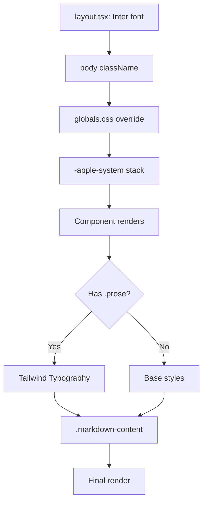

# CSS Typography & Fonts - Font System Analysis

**Date**: 2025-09-25
**Branch**: fix-dockerfile
**Commit**: 3cb52b172c1d9e0e33995ecfe1e5ec05e2f019f6
**Author**: Claude Code (automated audit)

## Overview

The application has a fragmented font and typography system with duplicate CSS files, conflicting font declarations, and inconsistent typography utilities.

## Font Declarations

### 1. Layout Font (Primary)
**Location**: `app/layout.tsx` (line 9)
```tsx
const inter = Inter({ subsets: ["latin"] })
```
**Applied**: Line 25 via `className={inter.className}`
**Impact**: Sets Inter as the base font for entire application

### 2. Global CSS Override
**Location**: `app/globals.css` (line 111)
```css
font-family: -apple-system, BlinkMacSystemFont, 'SF Pro Text',
             'SF Pro Display', 'Helvetica Neue', 'Helvetica',
             'Arial', sans-serif;
```
**Impact**: Overrides Inter with system fonts

### 3. Tailwind Typography Plugin
**Location**: Applied via `.prose` class
**Usage**: All markdown renderers
**Features**: Opinionated typography styles for content

## CSS File Structure

### File 1: `app/globals.css`
**Purpose**: Main application styles
**Key Features**:
- Custom CSS variables for theming
- Glass morphism effects
- Shadow utilities
- Font override to Apple system fonts

### File 2: `styles/globals.css`
**Purpose**: Legacy styles (should be removed)
**Key Features**:
- Markdown content hardening
- Different color palette
- Sidebar-specific variables
- No font overrides

## Typography Classes

### Markdown Content Classes
**Location**: `.markdown-content` (styles/globals.css lines 6-15)
```css
.markdown-content :where(p, li, h1, h2, h3, h4, h5, h6, blockquote) {
  word-break: keep-all;      /* do not break words/numbers */
  overflow-wrap: normal;     /* don't wrap inside words */
  hyphens: manual;           /* avoid auto hyphenation */
}
```

### Prose Classes (Tailwind Typography)
**Usage Patterns**:
1. **PennyResponseRenderer**: `.prose .prose-base .dark:prose-invert`
2. **AppleChatInterface**: `.prose .prose-base .dark:prose-invert`
3. **ChatInterface**: No wrapper (direct component styling)

### Utility Classes
| Class | Purpose | Location |
|-------|---------|----------|
| `.tabular-nums` | Fixed-width numbers | All renderers |
| `.break-words` | Word breaking | Apple & Penny |
| `.leading-relaxed` | Line height | Apple & Penny |
| `.text-balance` | Text wrapping | styles/globals.css |

## Font Loading Analysis

### Current Issues:
1. **No Font Preloading**: Inter loaded without preload
2. **FOUT Risk**: System font fallback causes flash
3. **Font Weight Variants**: Only default Inter weight loaded
4. **No Font Display Strategy**: Missing `font-display` setting

### Font Cascade:
```
1. Inter (from next/font/google)
   ↓ (overridden by)
2. -apple-system, BlinkMacSystemFont
   ↓ (fallback to)
3. SF Pro Text, SF Pro Display
   ↓ (fallback to)
4. Helvetica Neue, Helvetica
   ↓ (fallback to)
5. Arial, sans-serif
```

## Typography Rendering Pipeline



## CSS Variable System

### Color Variables
**Light Mode** (app/globals.css):
- Premium palette with blue primary (#0084FF)
- High contrast ratios
- Glass morphism support

**Dark Mode** (app/globals.css):
- Inverted palette
- Reduced contrast for comfort
- Transparent overlays

### Duplicate Definitions
Both CSS files define:
- `--background`, `--foreground`
- `--primary`, `--secondary`
- `--border`, `--input`
- Chart colors (different values!)

## Typography Component Overrides

### PennyResponseRenderer
```tsx
p: (props) => <p className="my-3" />
h1: (props) => <h1 className="mt-6 mb-3 text-2xl font-bold" />
h2: (props) => <h2 className="mt-5 mb-3 text-xl font-bold" />
```

### AppleChatInterface
```tsx
p: (props) => <p className="my-4 leading-relaxed" />
h1: (props) => <h1 className="mt-8 mb-4 text-2xl font-bold" />
h2: (props) => <h2 className="mt-8 mb-4 text-xl font-bold" />
```

### ChatInterface
```tsx
p: (props) => <p className="my-4 leading-relaxed" />
h1: (props) => <h1 className="mt-8 mb-4 text-2xl font-bold" />
h2: (props) => <h2 className="mt-8 mb-4 text-xl font-bold" />
```

## Performance Impact

### Current Performance Issues:
1. **Double CSS Parse**: Two globals.css files
2. **Cascade Conflicts**: Override calculations
3. **Font Loading**: Inter loads but isn't used
4. **Reflow Risk**: Font metrics differ between Inter and system

### Bundle Size:
- Inter font: ~17KB per weight
- Duplicate CSS: ~8KB (styles/globals.css)
- Unused variables: ~2KB

## Accessibility Considerations

### Positive:
- System fonts respect user preferences
- High contrast ratios in light mode
- Semantic HTML preserved

### Negative:
- No font size scaling variables
- Fixed px values in components
- No reduced motion preferences
- Inconsistent focus styles

## Best Practices Violations

1. **Font Loading**:
   - Loading Inter but not using it
   - No font-display strategy
   - No subsetting optimization

2. **CSS Organization**:
   - Duplicate global styles
   - Conflicting variable definitions
   - No CSS modules or scoping

3. **Typography System**:
   - Inconsistent spacing scales
   - Mixed units (px, rem, em)
   - No responsive typography

4. **Performance**:
   - No critical CSS extraction
   - No font preloading
   - Redundant style calculations

## Recommended Font Stack

### Option 1: System Fonts Only
```css
font-family: system-ui, -apple-system, 'Segoe UI', Roboto,
             'Helvetica Neue', Arial, sans-serif;
```

### Option 2: Inter with Preload
```tsx
const inter = Inter({
  subsets: ["latin"],
  display: 'swap',
  preload: true,
  variable: '--font-inter'
})
```

### Option 3: Custom Font Loading
```tsx
import { GeistSans } from 'geist/font/sans'
import { GeistMono } from 'geist/font/mono'
```

## Typography Scale

### Current (Inconsistent):
- Base: 16px (assumed)
- H1: text-2xl (24px)
- H2: text-xl (20px)
- H3: text-lg (18px)
- Body: prose-base (16px)

### Recommended (Harmonious):
- Base: 1rem (16px)
- H1: 2.25rem (36px)
- H2: 1.875rem (30px)
- H3: 1.5rem (24px)
- H4: 1.25rem (20px)
- Body: 1rem (16px)
- Small: 0.875rem (14px)

## Critical Issues Summary

1. **Inter font loads but is overridden** - Wastes bandwidth
2. **Two globals.css files** - Conflicting styles
3. **No markdown-content class** in ChatInterface - Missing hardening
4. **Different spacing** in component overrides - Visual inconsistency
5. **No font metrics optimization** - FOUT/FOIT risk