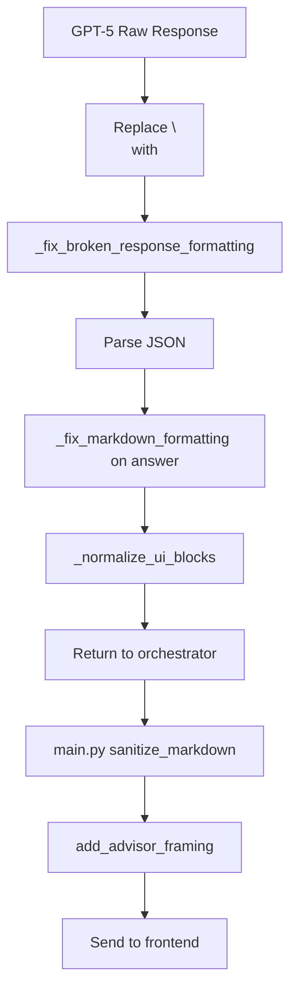

# Backend Formatters - Text Normalization

**Date**: 2025-09-25
**Branch**: fix-dockerfile
**Commit**: 3cb52b172c1d9e0e33995ecfe1e5ec05e2f019f6
**Author**: Claude Code (automated audit)

## Overview

The backend employs multiple layers of text processing and normalization functions, creating a complex pipeline that can cause conflicts and unintended transformations.

## Text Processing Functions

### 1. Main.py - sanitize_markdown
**Location**: `TRUEFIBACKEND/main.py` (lines 283-347)

**Purpose**: Reflow paragraphs and fix formatting issues

**Key Operations**:
```python
# 1. Remove zero-width characters
for zw in ['\u200b', '\u200c', '\u200d', '\u2060', '\ufeff']:
    text = text.replace(zw, '')

# 2. Normalize spaces
text = text.replace('\u2009', ' ').replace('\u202f', ' ')

# 3. Reflow paragraphs (complex logic)
- Preserves code blocks
- Joins single line breaks
- Maintains markdown structure

# 4. Post-processing fixes
text = re.sub(r'([A-Za-z])(\d)', r'\1 \2', text)  # Form1099 -> Form 1099
text = re.sub(r'(\d)([A-Za-z])', r'\1 \2', text)  # 100USD -> 100 USD
text = re.sub(r'(\d),\s+(\d{3})', r'\1,\2', text) # 4, 000 -> 4,000
```

**Applied**: To all chat responses before sending to frontend

### 2. GPT5 Agent - _fix_broken_response_formatting
**Location**: `TRUEFIBACKEND/agents/gpt5_unified_agent.py` (lines 525-560)

**Purpose**: Fix character-per-line formatting from GPT-5

**Detection Logic**:
```python
lines = text.split('\n')
single_char_lines = sum(1 for line in lines if len(line.strip()) == 1)

# If >30% of lines are single chars, likely broken
if len(lines) > 10 and single_char_lines / len(lines) > 0.3:
    # Reconstruct the text
```

**Reconstruction**:
```python
reconstructed = []
current_word = []
for line in lines:
    stripped = line.strip()
    if len(stripped) == 1:
        current_word.append(stripped)
    else:
        if current_word:
            reconstructed.append(''.join(current_word))
        reconstructed.append(stripped)
```

### 3. GPT5 Agent - _fix_markdown_formatting
**Location**: `TRUEFIBACKEND/agents/gpt5_unified_agent.py` (lines 797-875)

**Purpose**: Fix markdown-specific formatting issues

**Key Patterns**:
```python
# 1. Merge single letters separated by newlines
text = re.sub(r'(?<=\b)([a-z])\n(?=[a-z]\b)', r'\1', text, flags=re.IGNORECASE)

# 2. Fix split numbers
text = re.sub(r'(\d+)\n,\n(\d+)', r'\1,\2', text)  # 305\n,\n176 -> 305,176

# 3. Fix dollar amounts
text = re.sub(r'\$\s*(\d)', r'$\1', text)  # $ 100 -> $100
text = re.sub(r'\$(\d+(?:,\d+)*(?:\.\d+)?)([a-z])', r'$\1 \2', text)  # $100salary -> $100 salary

# 4. Escape special markdown chars
text = re.sub(r'(?<!\\)_', r'\_', text)  # WELLS_FARGO -> WELLS\_FARGO
text = re.sub(r'(?<!\\)\*', r'\*', text)

# 5. Fix spaced thousands
text = re.sub(r'(\d+),\s+(\d{3})', r'\1,\2', text)  # 4, 000 -> 4,000
```

### 4. GPT5 Agent - Escaped Newline Handling
**Location**: `TRUEFIBACKEND/agents/gpt5_unified_agent.py` (lines 496-498)

```python
# First handle escaped newlines in the raw JSON string
if '\\n' in content:
    content = content.replace('\\n', '\n')
```

**Applied**: Before JSON parsing

### 5. GPT5 Agent - Answer Formatting
**Location**: `TRUEFIBACKEND/agents/gpt5_unified_agent.py` (lines 913-916)

```python
# Handle escaped newlines in the answer field
if '\\n' in answer:
    answer = answer.replace('\\n', '\n')
```

## Processing Pipeline Order



## Regex Pattern Analysis

### Character Merging Patterns
| Pattern | Purpose | Location |
|---------|---------|----------|
| `(?<=\b)([a-z])\n(?=[a-z]\b)` | Merge single letters | gpt5_unified_agent |
| `(?<=[\d,\.])\n(?=[\d,\.])` | Remove breaks in numbers | main.py |
| `(?<=\w)\n(?=\w)` | Join words across lines | main.py |

### Number Formatting Patterns
| Pattern | Purpose | Example |
|---------|---------|---------|
| `(\d+)\n,\n(\d+)` | Fix split numbers | 305\n,\n176 → 305,176 |
| `(\d),\s+(\d{3})` | Fix spaced thousands | 4, 000 → 4,000 |
| `\$\s*(\d)` | Fix spaced dollars | $ 100 → $100 |

### Text Spacing Patterns
| Pattern | Purpose | Example |
|---------|---------|---------|
| `([A-Za-z])(\d)` | Space letter-digit | Form1099 → Form 1099 |
| `(\d)([A-Za-z])` | Space digit-letter | 100USD → 100 USD |
| `\$(\d+(?:,\d+)*(?:\.\d+)?)([a-z])` | Space after amounts | $100salary → $100 salary |

## Unicode Character Handling

### Zero-Width Characters Removed
- `\u200b` - Zero-width space
- `\u200c` - Zero-width non-joiner
- `\u200d` - Zero-width joiner
- `\u2060` - Word joiner
- `\ufeff` - Zero-width no-break space

### Space Normalizations
- `\u2009` → ` ` (Thin space to normal space)
- `\u202f` → ` ` (Narrow no-break space to normal)
- `\u2011` → `-` (Non-breaking hyphen to normal)

## Normalization Functions

### _normalize_result (GPT-5 Agent)
**Location**: Lines 605-623
**Purpose**: Ensure required fields exist
```python
result.setdefault('answer_markdown', "Analysis completed.")
result.setdefault('assumptions', [])
result.setdefault('computations', [])
result.setdefault('ui_blocks', [])
```

### _normalize_ui_blocks (GPT-5 Agent)
**Location**: Lines 625-795
**Purpose**: Coerce UI blocks to frontend shape
- Handles bar_chart dataset normalization
- Ensures required fields exist
- Validates data arrays

### _normalize_rate (Calculations)
**Location**: `agents/calculations.py` Lines 30-45
**Purpose**: Convert percentage rates to decimals
```python
# Convert 7 -> 0.07, 18 -> 0.18
if r > 1:
    r = r / 100.0
# Clamp to [0, 1]
return max(0, min(r, 1))
```

## Reflow Logic Analysis

### Main.py Paragraph Reflow
**Lines 293-332**:
```python
def flush():
    if buf:
        para = ' '.join([s.strip() for s in buf])
        para = re.sub(r'\s{2,}', ' ', para)
        out.append(para)

# Preserve structural lines
if s.startswith(('#', '>', '|')) or re.match(r'^[*-]\s+', s):
    flush()
    out.append(line)
```

**Preserves**:
- Headers (#)
- Blockquotes (>)
- Tables (|)
- Lists (*, -, 1.)
- Code blocks (```)

**Joins**: Regular paragraph lines

## Common Issues and Conflicts

### 1. Multiple Escape Handling
- GPT-5 agent handles `\\n` → `\n` twice
- Could cause double-unescaping issues

### 2. Order Dependency
- Markdown escaping (`\_`) happens before sanitize_markdown
- Frontend scrub removes different characters than backend

### 3. Regex Overlaps
- Multiple patterns target similar structures
- Order of application matters

### 4. Lost Formatting
- Aggressive reflow can merge intended line breaks
- Code detection relies on ``` markers only

### 5. Character Reconstruction
- Complex logic for detecting broken formatting
- 30% threshold may miss edge cases

## Performance Impact

### Regex Operations Count
- Main.py sanitize: 8+ regex operations
- GPT-5 formatting: 15+ regex operations
- Total per message: 23+ regex passes

### String Operations
- Multiple full text replacements
- String splitting and joining
- Character-by-character reconstruction

### Memory Usage
- Multiple intermediate string copies
- Buffer accumulation in reflow
- Regex compilation overhead

## Test Coverage

### Existing Tests
- `test_formatting.py` - Basic markdown formatting
- `test_markdown_sanitization.py` - Sanitization edge cases

### Missing Tests
- Character reconstruction logic
- Interaction between formatters
- Performance with large responses
- Unicode edge cases
- Markdown structure preservation

## Recommended Consolidation

### Single Formatting Pipeline
```python
class UnifiedFormatter:
    def format(self, text: str) -> str:
        # 1. Handle escape sequences
        # 2. Fix broken formatting
        # 3. Normalize unicode
        # 4. Fix markdown issues
        # 5. Reflow if needed
        return text
```

### Benefits:
- Single source of truth
- Predictable ordering
- Easier testing
- Better performance
- Reduced conflicts